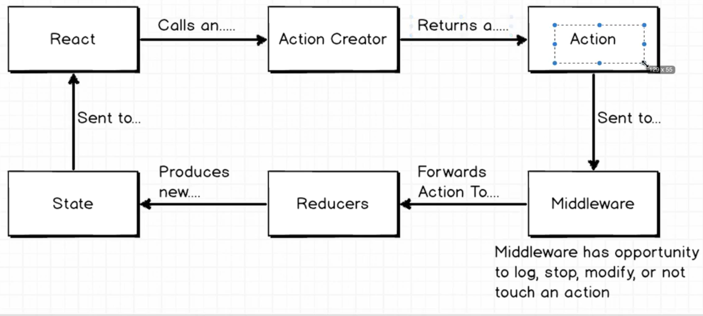
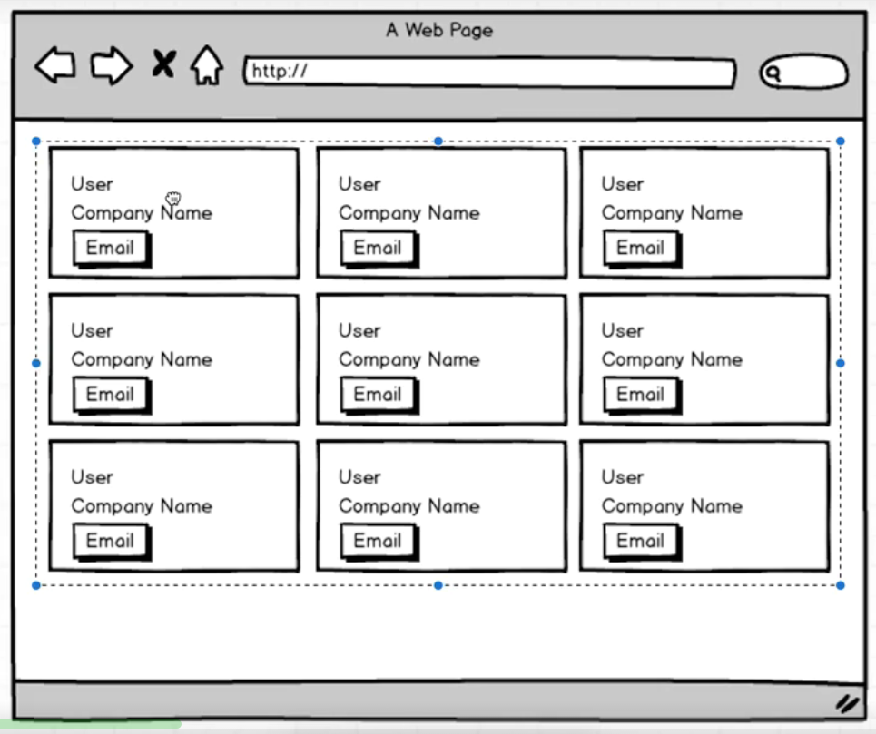

源代码参考：https://github.com/StephenGrider/AdvancedReduxCode

 

> https://github.com/StephenGrider/ReduxSimpleStarter

 

> 下载并拷贝

 

> npm install

 

> npm start

 

> localhost:8080

 

> redux middleware是什么？

 

是Action和Reducer之间的middleware.

 

> 要做的效果

 

