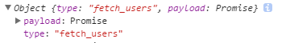

> http://jsonplaceholder.typicode.com/

 

> npm install axios --save

 

现在，在action中获取真实的数据。

 

> src/actions/index.js

 

	import axios from 'axios';
	import { FETCH_USERS } from './types';
	
	export function fetchUsers(){
	    
	    const request = axios.get('http://jsonplaceholder.typicode.com/users');
	    
	    return {
	        type: FETCH_USERS,
	        payload: request
	    };
	}

 

> localhost:8080

 
**此时，是获取不到数据的，因为action返回的是promise。**

 

所以，现在我们的需求是：**reducer是否可以拿到真实的数据，而不是Promise呢？**

 
这真是middleware登上舞台的时候。

 

 

> src下添加middlewares目录

 

> src/middlewares目录下添加async.js

 

	export default function({ dispatch }){
	    return next => action => {
	        console.log(action);
	        next(action);
	    };
	}

这就是我们要添加的middleware,似乎是把action交给next方法，而next返回的方法要么给了其它的middleware,要么给到了reducer.

 

或者写成这样：

	export default function({ dispatch }){
	    return function(next){
	        return function(action){
	            console.log(action);
	            next(action);
	        }
	    }
	}

 

**如何注册middleware呢？**

 

> src/index.js

 

	import React from 'react';
	import ReactDOM from 'react-dom';
	import { Provider } from 'react-redux';
	import { createStore, applyMiddleware } from 'redux';
	
	import App from './components/app';
	import reducers from './reducers';
	import Async from './middlewares/async';
	
	const createStoreWithMiddleware = applyMiddleware(Async)(createStore);
	
	ReactDOM.render(
	  <Provider store={createStoreWithMiddleware(reducers)}>
	    <App />
	  </Provider>
	  , document.querySelector('.container'));

 

> localhost:8080

 

这就是middleware大致的工作原理。

 

**middleware是否可以让reducer拿到真实的、resolved的数据呢？ 而不是Promise?**

 

看来，我们要在middleware中resolve了。

 

> src/middlewares/async.js

 

	export default function({ dispatch }){
	    return next => action => {
	        if(!action.payload || !action.payload.then){
	            return next(action);
	        }
	        // 确保action's promise resolves
	        action.payload
	            .then(function(response){
	               const newAction =  {...action, payload: response};
	                dispatch(newAction);
	            });
	    }
	}

 

> src/reducers/users.js

 

	import { FETCH_USERS } from '../actions/types';
	
	export default function(state = [], action){
	    switch(action.type){
	        case FETCH_USERS:
	            return [...state, ...action.payload.data];
	    }
	    
	    return state;
	}

 

> src/components/user_list.js

 

	import React, { Component } from 'react';
	import { connect } from 'react-redux';
	import * as actions from '../actions';
	
	class UserList extends Component {
	  componentWillMount() {
	    this.props.fetchUsers();
	  }
	
	  renderUser(user) {
	    return (
	      

	        <h4 className="card-title">{user.name}</h4>
	        
{user.company.name}

	        <a className="btn btn-primary" href={user.website}>Website</a>
	      

	    );
	  }
	
	  render() {
	    return (
	      

	        {this.props.users.map(this.renderUser)}
	      

	    );
	  }
	}
	
	function mapStateToProps(state) {
	  return { users: state.users };
	}
	
	
	
	export default connect(mapStateToProps, actions)(UserList);

 

> style/style.css

 

	.user-list{
	    display: flex;
	    justify-content: space-around;
	    flex-wrap: wrap;
	}
	
	.card{
	    width: 30%;
	    min-width: 300px;
	}

 

